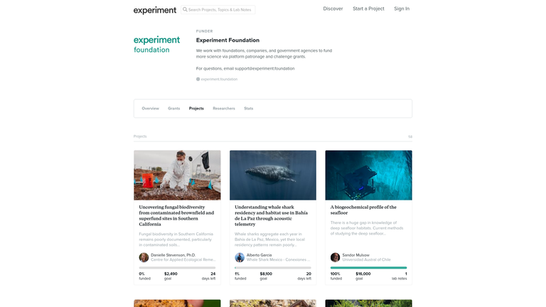
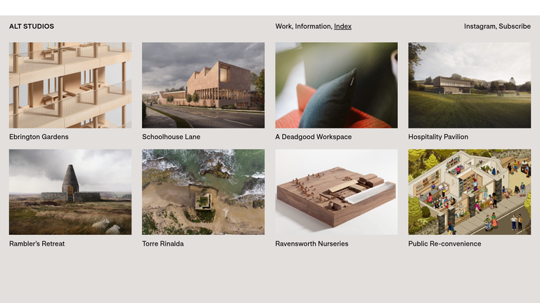
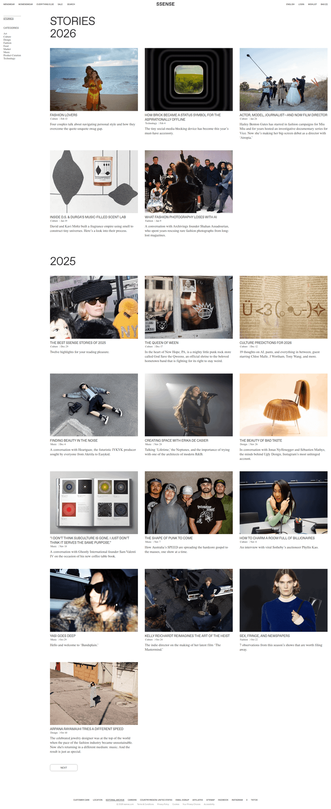
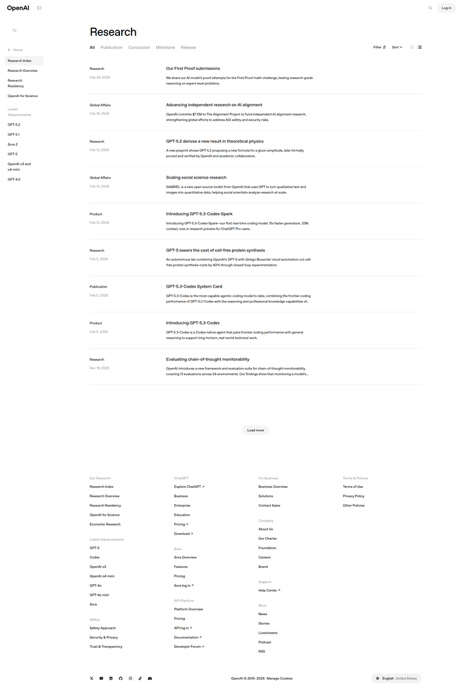
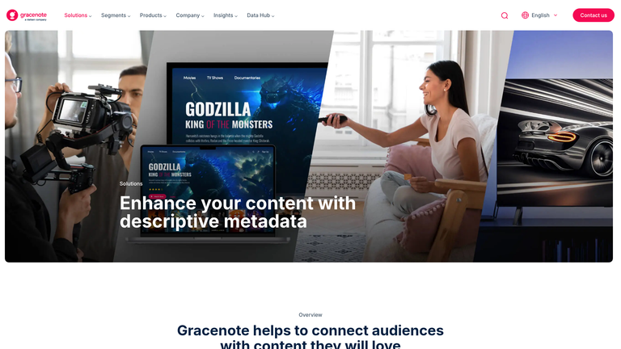
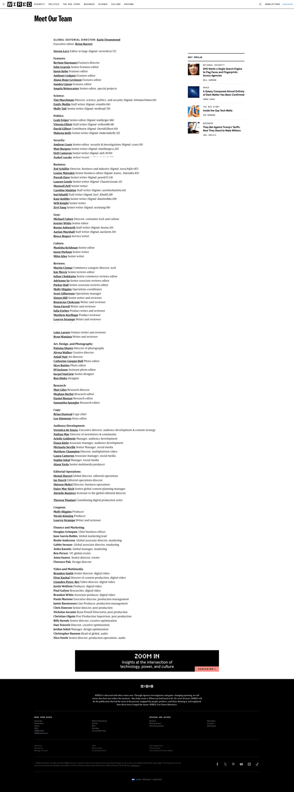

# MAIR Lab 一页式官网方向脑暴

**Lazyweb 在线视觉变体报告：** https://www.lazyweb.com/report/lazyweb/8f378bf4-1993-4557-9673-ee65ef979cf9/?source=create

## TL;DR

建议优先比较 **A. Research Atlas** 与 **B. Living Journal**。A 最像一个成熟的国际研究机构，适合清晰呈现项目、论文与开源成果；B 更能延续当前 Signature Spine 的“署名宣言”气质。C 信息效率最高，D 视觉记忆最强但内容维护成本也最高。

## Current State


当前首屏已经形成明确的视觉资产：白色画布、Instrument Serif 大标题、Inter 正文、MAIR/HUST 双 Logo、MAIR 签名，以及底部原色视频。后续页面应把这些资产扩展为系统，而不是另起一套风格。

## 先选方向

| 方向 | 新颖度 | 可实施性 | 最适合 | 建议 |
|---|---|---|---|---|
| A. Research Atlas | 高 | 高 | 项目与开源成果是官网核心 | 首选 |
| B. Living Journal | 高 | 高 | 强调实验室叙事、观点与持续更新 | 首选 |
| C. Signal Spine | 中高 | 很高 | 论文、里程碑、团队信息较多 | 稳妥 |
| D. Cinematic Field Notes | 很高 | 中 | 有足够高质量视频、图片和 demo | 大胆方案 |

## 常规实验室网站的做法



典型方案把研究项目做成规则卡片网格，清晰但容易变成通用模板。MAIR 当前首屏拥有更强的编辑感，因此下方需要保留可扫描性，同时避免重复的圆角卡片。

---

## A. Research Atlas — 研究图谱



**迁移模式：** 借用建筑事务所的项目索引。每个研究方向不是一张 SaaS 卡片，而是一块“研究场域”：大图或 demo 帧、项目代号、研究问题、论文/代码状态。项目之间使用细黑线和编号建立秩序。

**页面顺序：**

1. 现有 Hero + 原色视频
2. Research Atlas：四个主方向的无缝图像网格
3. Featured Systems：TMPO、I2E 等重点项目的大幅案例段落
4. Open Source Ledger：仓库、Stars、状态、论文链接的表格式索引
5. Vision：超大字号宣言与一张研究过程图
6. Publications：按年份排列的论文索引
7. People / Join Us：紧凑人员目录与招聘入口
8. Footer：双 Logo、地址、GitHub、Email

```text
┌──────────────────────────────────────────────────────┐
│ CURRENT SIGNATURE HERO                               │
├──────────────────────────────────────────────────────┤
│ 01 PERCEPTION            │ 02 GENERATION             │
│ [large research visual]  │ [large research visual]   │
├──────────────────────────┼───────────────────────────┤
│ 03 REASONING             │ 04 ACTION                 │
├──────────────────────────────────────────────────────┤
│ FEATURED SYSTEM / TMPO                  [full width]  │
├──────────────────────────────────────────────────────┤
│ OPEN SOURCE LEDGER      repo / paper / status / year │
├──────────────────────────────────────────────────────┤
│ VISION → PUBLICATIONS → PEOPLE → JOIN → FOOTER       │
└──────────────────────────────────────────────────────┘
```

**为什么适合 MAIR：** 多模态研究天然有多条相互连接的研究线，图谱结构能让访问者快速理解“我们研究什么”，也能容纳未来项目扩展。

---

## B. Living Journal — 活的研究期刊



**迁移模式：** 把官网当作一本不断更新的研究期刊。研究项目、论文、开源发布和实验室新闻不再分成互不相关的模块，而以“Feature / Note / Release / Paper”编辑标签组成一条内容节奏。

**页面顺序：**

1. 现有 Hero + 视频作为封面
2. Issue 01 / What We Build：一篇主叙事 + 两篇小故事
3. Research Features：左右交替的大图与摘要
4. Latest Notes：论文、代码、新闻混排的时间档案
5. Manifesto：保留 MAIR 签名，放大为章节分隔
6. Editorial Team：按研究方向而不是职位组织成员
7. Join the Next Issue：招聘 CTA
8. 极简文字 Footer

```text
┌──────────────────────────────────────────────────────┐
│ CURRENT SIGNATURE HERO / COVER                       │
├──────────────────────────────────────────────────────┤
│ ISSUE 01         │ FEATURE STORY                     │
│ What We Build    │ [large image] + long headline     │
├──────────────────┴───────────────────────────────────┤
│ NOTE 01                │ NOTE 02                     │
├────────────────────────┴─────────────────────────────┤
│ RESEARCH FEATURE [image]    text                     │
│ text                        [image]                   │
├──────────────────────────────────────────────────────┤
│ 2026 ARCHIVE: PAPER / RELEASE / NEWS / DEMO          │
├──────────────────────────────────────────────────────┤
│ MANIFESTO → EDITORIAL TEAM → JOIN → FOOTER           │
└──────────────────────────────────────────────────────┘
```

**为什么适合 MAIR：** 当前首屏已经像一篇有作者的宣言。Living Journal 会把这种“有人在表达观点”的感觉延伸到整页，比普通实验室官网更有人格。

---

## C. Signal Spine — 信号脊柱



**迁移模式：** 延续 Signature Spine 的“脊柱”概念，在页面中央建立一条细竖线。所有项目、论文、开源节点、成员和里程碑沿这条轴展开，形成一条可滚动的研究轨迹。

**页面顺序：**

1. 现有 Hero + 视频
2. Central Spine：Research 四个节点左右交替
3. Systems Timeline：重点项目与年份
4. Open Source Signals：仓库数据与最新 Release
5. Publications：按年份挂在线轴上
6. People：导师、研究员、学生按层级展开
7. Join Us：轴线终点变成申请按钮

```text
┌──────────────────────────────────────────────────────┐
│ CURRENT SIGNATURE HERO                               │
├──────────────────────────┬───────────────────────────┤
│ PERCEPTION               │                           │
│                          ● 2026                      │
│                          │              GENERATION   │
│ REASONING                ●                           │
│                          │              ACTION       │
│ TMPO                     ● 2025                      │
│                          │                           │
│ PUBLICATIONS             ● OPEN SOURCE               │
│                          │                           │
│ PEOPLE                   ● JOIN US                   │
└──────────────────────────┴───────────────────────────┘
```

**为什么适合 MAIR：** 信息密度高，但仍有强烈的品牌概念；尤其适合把“感知 → 生成 → 推理 → 行动”表现成连续演进。

---

## D. Cinematic Field Notes — 电影式田野笔记



**迁移模式：** 每个研究方向是一章全宽影像，滚动时文字像片头字幕一样出现。视频、demo、模型可视化与论文结论交替，减少传统列表感。

**页面顺序：**

1. 现有 Hero + 视频
2. Chapter 01–04：四个全屏研究章节
3. Demo Reel：开源项目横向轨道
4. Manifesto：黑底白字的短暂反转章节
5. Selected Publications：只展示 6–8 篇旗舰论文
6. People Portraits：大幅肖像与一句研究问题
7. Join the Lab：全屏结尾

```text
┌──────────────────────────────────────────────────────┐
│ CURRENT SIGNATURE HERO                               │
├──────────────────────────────────────────────────────┤
│ CHAPTER 01 / PERCEPTION       [FULL-BLEED DEMO]      │
├──────────────────────────────────────────────────────┤
│ CHAPTER 02 / GENERATION       [FULL-BLEED DEMO]      │
├──────────────────────────────────────────────────────┤
│ CHAPTER 03 / REASONING        [FULL-BLEED DEMO]      │
├──────────────────────────────────────────────────────┤
│ DEMO REEL → MANIFESTO → PAPERS → PORTRAITS → JOIN   │
└──────────────────────────────────────────────────────┘
```

**风险：** 对影像质量、性能优化和持续内容制作要求最高。若缺少高质量 demo，这个方向会显得空。

---

## 可复用的内容模块



无论选择哪个方向，都建议统一保留以下内容：

- Research：Perception / Generation / Reasoning / Action
- Featured Projects：至少 2 个重点系统
- Open Source：仓库、论文、Demo 三类入口
- Publications / News：可按年份维护
- Vision：保留 authored manifesto 的品牌语气
- People / Join Us：用清晰研究方向组织，而不是长段履历
- Footer：MAIR × HUST、地址、GitHub、Email

## 我的建议

如果你希望官网看起来最像一个成熟国际研究机构，选 **A**。如果你更在意品牌人格和视觉记忆，选 **B**。如果内容很多且希望后续容易维护，选 **C**。如果你准备持续提供高质量视频和 demo，选 **D**。

## References

- Experiment Foundation project discovery [Lazyweb]
- SSENSE editorial archive [Lazyweb]
- ALT Studios work index [Lazyweb]
- OpenAI research index [Lazyweb]
- WIRED staff directory [Lazyweb]
- Gracenote cinematic content page [Lazyweb]
- Architecture publishing patterns: BIG, Snøhetta, and long-form project storytelling [Web]
