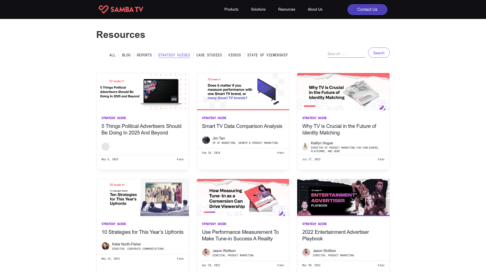
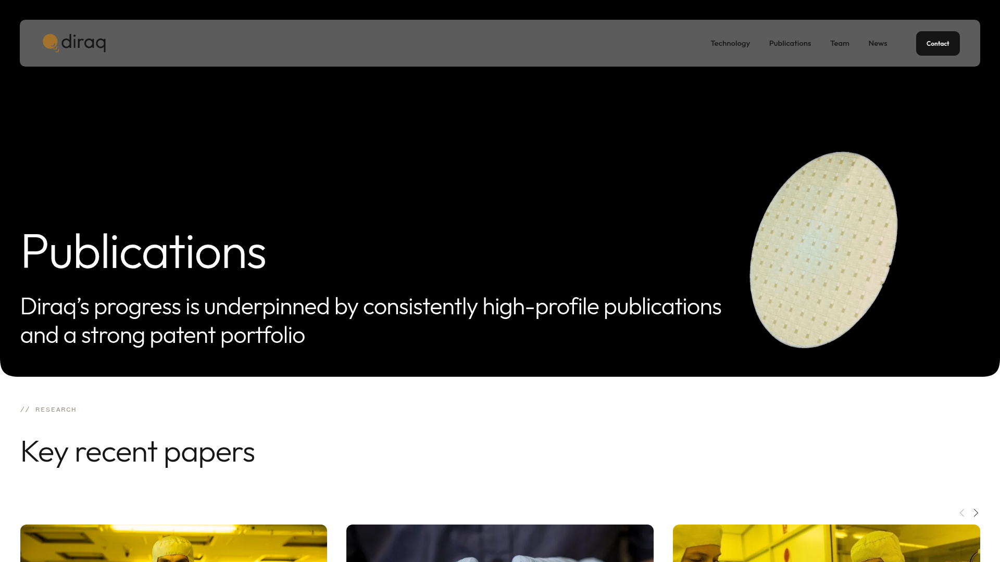
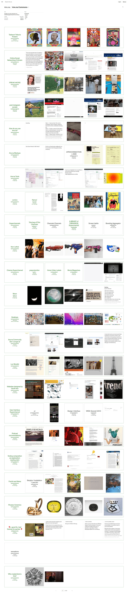
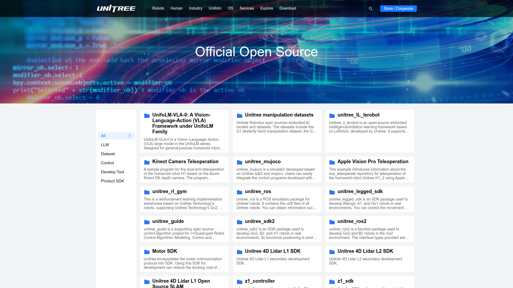

# Design Brainstorm: MAIR Lab Papers & Projects

## TL;DR

优先原型化 **方案 B：交替编辑特写**。它最贴合当前 MAIR 首页的白底、黑字、细线与大字号衬线标题，同时能让论文图、项目 Demo、摘要和链接都获得足够空间。

完整 Lazyweb 视觉方案：[打开 Hosted Report](https://www.lazyweb.com/report/lazyweb/43a65a7b-fafe-41c5-ba01-88531c48dfdd/?source=create)

## Which Ideas to Prototype

| 方案 | 新颖度 | 可实施性 | 建议 |
|---|---|---|---|
| B. 交替编辑特写 | High | High | 首选 |
| A. Publications / Open Source 双标签 | Medium | High | 稳妥备选 |
| D. 海报墙拼贴 | High | Medium | 视觉型备选 |
| C. 横向成果书架 | High | Medium | 内容多时使用 |

## A. 双标签卡片列表



**模式：** 顶部切换 `Publications / Open Source`，下面使用统一的图文卡片网格。每张卡包含论文图、标题、venue、摘要和链接。

**适合：** 内容分类清楚、后续条目会持续增长的实验室主页。

```text
PUBLICATIONS  |  OPEN SOURCE
┌──────────────┐ ┌──────────────┐ ┌──────────────┐
│    FIGURE    │ │    FIGURE    │ │    FIGURE    │
│ I2E          │ │ TMPO         │ │ SciIR        │
│ ACL 2026     │ │ arXiv 2026   │ │ ECCV 2026    │
│ Paper · Code │ │ Paper · Code │ │ Paper · Code │
└──────────────┘ └──────────────┘ └──────────────┘
```

## B. 交替编辑特写



**模式：** 每个成果占一整行，图片与文字左右交替。大图展示论文 figure 或项目画面，另一侧承载标题、摘要和链接。

**适合：** 当前首页。它延续宣言式排版，同时比普通卡片更有研究品牌感。

```text
SELECTED WORK
┌──────────────────────┐  I2E
│       FIGURE         │  From Image Pixels to...
└──────────────────────┘  ACL 2026 · Paper · Project

TMPO                       ┌──────────────────────┐
Trajectory Matching...     │       FIGURE         │
arXiv 2026 · Paper · Code  └──────────────────────┘
```

## C. 横向成果书架



**模式：** Papers 和 Projects 各形成一条横向滚动书架，图片卡连续排列，鼠标或触控横向浏览。

**适合：** 成果数量较多，希望首页保持较短，同时突出浏览感。

```text
PAPERS                                      VIEW ALL
[ I2E ] [ TMPO ] [ SciIR ] [ Next Paper ]  →

PROJECTS                                    VIEW ALL
[ TMPO ] [ SciIR ] [ Demo ] [ Dataset ]     →
```

## D. 海报墙拼贴



**模式：** 以论文图和 Demo 画面为主角，使用一大两小的拼贴节奏，文字作为图片下方的简洁图注。

**适合：** figure 质量高、希望网站更像研究展览或设计画册时。

```text
RESEARCH WALL
┌───────────────────────────┐ ┌─────────────┐
│       FEATURED I2E        │ │    TMPO     │
│        LARGE IMAGE        │ └─────────────┘
└───────────────────────────┘ ┌─────────────┐
                              │    SciIR    │
                              └─────────────┘
```

## Recommendation

先实现方案 B，并在其下方增加一个方案 A 风格的紧凑 `All Publications` 列表。这样首页前三项成果有强视觉叙事，后续论文仍然容易扩展。

