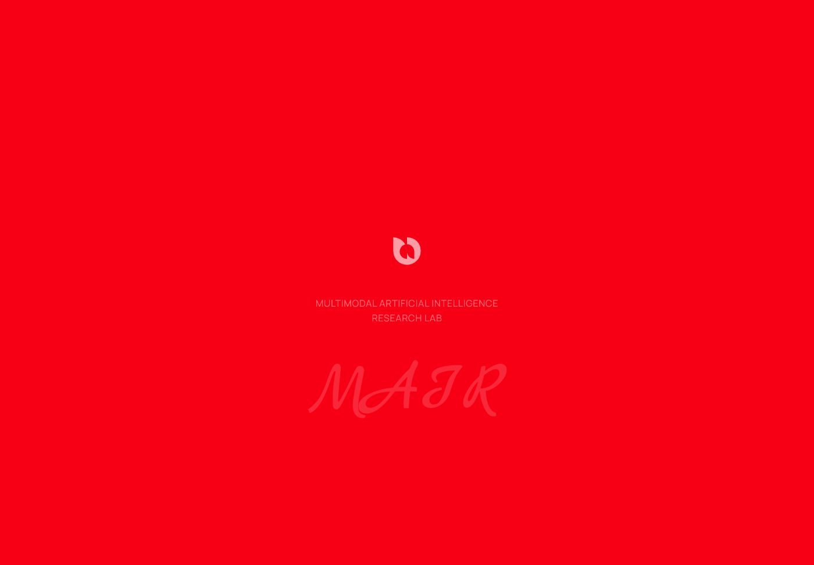
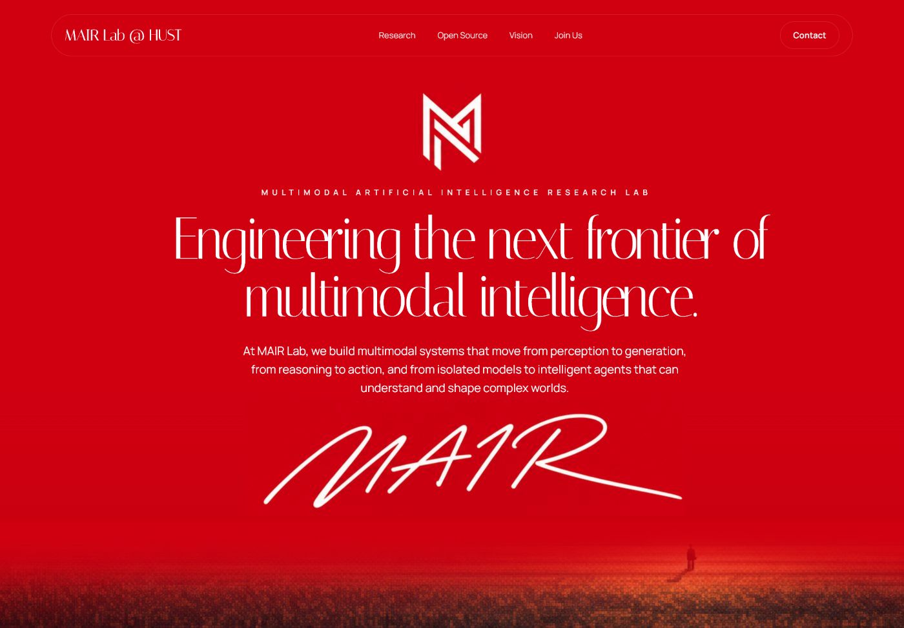

# Design Implementation: Signature Spine

## TL;DR

Implemented the report's **Signature Spine** variant using its mockup as the visual source of truth, then adapted it to the requested monochrome art direction. The 1400×974 composition is preserved while the canvas is now white, the typography and signature are black, and the supplied MAIR logo replaces the mockup mark.

## Source Mockup

## Before

## Initial Mockup Match

## Monochrome Revision

## Match Notes

- Header frame: 1242×65 at x=79, y=22 on the 1400×974 reference viewport.
- Editorial title: 91px Instrument Serif, visually condensed to the mockup's 922px footprint.
- Body typography: Inter 400/500 through the shared `--font-body` token.
- Copy, line breaks, and vertical hierarchy follow the mockup; the requested white/black palette is applied throughout.
- The supplied MAIR logo is bundled locally as a Vite-hashed asset, while the handwritten signature is rendered black on white.
- The HUST emblem is paired to the right of the MAIR mark with a restrained vertical divider and responsive clear space.
- The red-tinted mockup fallback has been removed; the supplied video is bundled locally and plays beneath the white fade without a color filter.
- Desktop and 390px mobile layouts have zero horizontal overflow.
- The bottom landscape acts as a deterministic fallback while the supplied Cloudinary video is unavailable.

## Source Report

<https://www.lazyweb.com/report/lazyweb/d9546379-cb7f-490f-96ee-74c8163e1ffd/?source=create>
