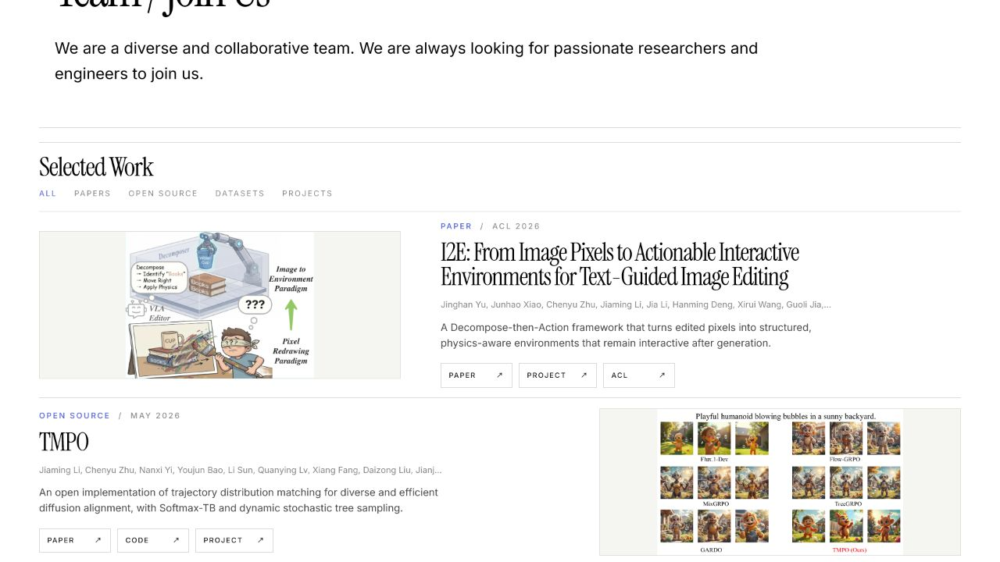
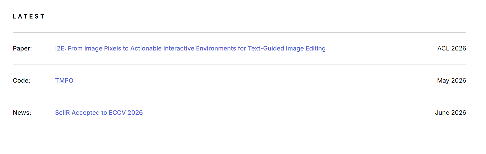
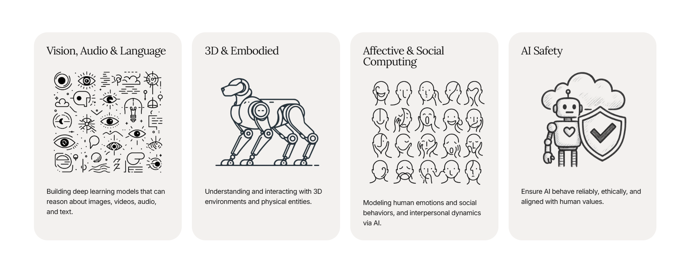

# Design Improvement: MAIR Lab Homepage Structure

## TL;DR

Reduce the homepage to three primary editorial sections—Research, Publications, and Join Us—while keeping News as a compact utility list. Publications should show only papers in reverse chronological order, and Research should use four clear visual direction cards.

Hosted Lazyweb report: https://www.lazyweb.com/report/lazyweb/c8654a0b-88c0-4484-9f59-f514344eae29/?source=create

## Current State

The previous version separated a generic five-heading information list from a second “Selected Work” module, which duplicated hierarchy and mixed papers with open-source project entries.

## Improvement Ideas

### 1. Consolidate publications under one large heading

Move the alternating figure rows directly beneath `Publications`, remove the Selected Work title and its category strip, and keep only publication records.

**Inspired by:**

### 2. Make publication metadata a single badge

Place one compact venue/type badge below each title instead of a separate metadata row above it.

**Inspired by:**

### 3. Turn Latest into lab News

Use the existing compact list structure for lab announcements, ordered newest first.

**Inspired by:**

### 4. Explain research through four visual cards

Use four rounded neutral cards with a display title, a large research visual, and a short plain-language description.

**Inspired by:**

## What’s Working

- Instrument Serif and Inter already provide a strong editorial research identity.
- The white/black/blue palette is restrained and appropriate for an academic lab.
- Alternating publication rows make dense technical material easier to scan.
- Real figures from I2E, TMPO, and SciIR establish credibility.

## Implemented Direction

- News: SciIR, TMPO, I2E announcements in reverse chronological order.
- Research: four responsive cards for Multimodal Generation, Interactive Environments, Diffusion Alignment, and Scientific Visual Intelligence.
- Publications: SciIR, TMPO, I2E papers only, ordered newest to oldest.
- Join Us: simplified closing section with one contact action.

